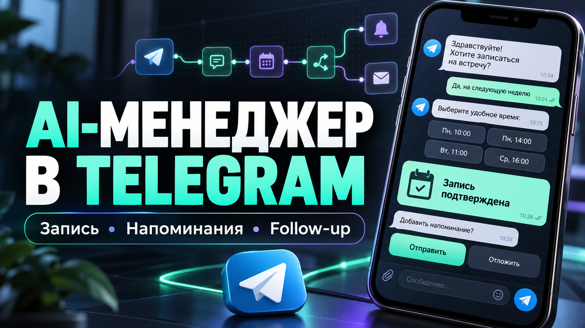
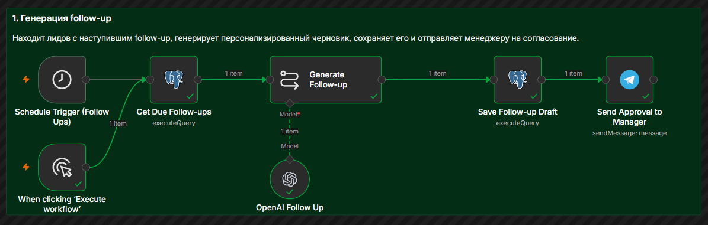
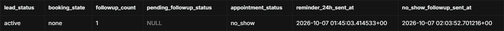
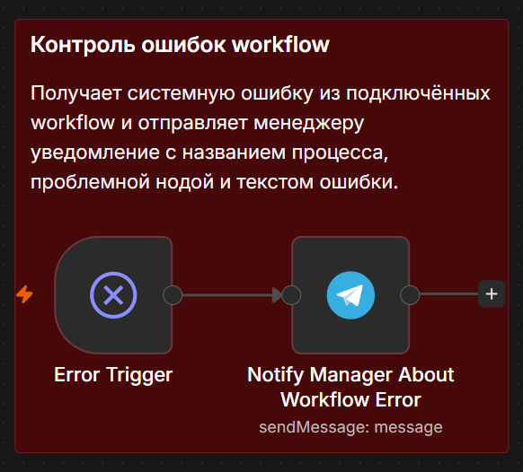
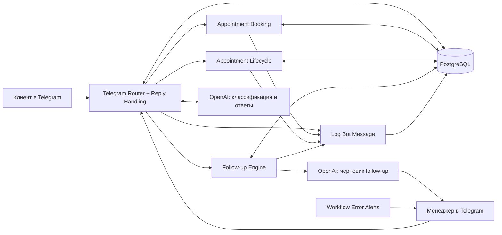

# AI Follow-up & Appointment Manager

**Запись на встречу, напоминания, передача менеджеру и AI follow-up - в одном Telegram-процессе.**

Портфельный MVP на **n8n + Telegram Bot API + OpenAI + PostgreSQL**. Показывает полный путь от клиентского сообщения до записи и следующего контакта. Это демонстрационный проект, не коммерческий кейс с подтверждённой выручкой или экономией времени.

**Автор: Даниил, AI Automation Engineer. [Обсудить интеграцию в Telegram](https://t.me/eaojjm).**

> Обложка - AI-иллюстрация интерфейса, а не скриншот работающего бота. Ниже приведены реальные кадры демо.

## Что делает система

| Для клиента | Для менеджера | На стороне backend |
| --- | --- | --- |
| Запрашивает имя и телефон при записи | Передаёт запрос и контекст диалога | Хранит состояние клиента и записи в PostgreSQL |
| Предлагает свободные слоты | Позволяет отвечать клиенту через Reply на уведомление бота | Маршрутизирует сообщения и callback-кнопки |
| Подтверждает запись, перенос и отмену | Запрашивает результат встречи: состоялась / no-show | Останавливает запланированный follow-up после ответа клиента |
| Напоминает о предстоящей встрече | Предлагает отправить сообщение после no-show | Сохраняет историю сообщений и версию AI-черновика |
| Получает одобренный повторный контакт | Даёт выбор: отправить, отложить или закрыть лида | Использует claim-резервирование в ветках отправки |

AI классифицирует намерение клиента и готовит текст следующего контакта на основе контекста. Для согласуемого follow-up решение об отправке остаётся за менеджером. Инструкции генерации запрещают придумывать предложения, скидки и результаты, которых нет в контексте.

### Пример сценария

1. Клиент пишет боту, указывает данные и выбирает свободное время.
2. При вопросе, требующем человека, бот передаёт диалог менеджеру.
3. Клиент может перенести или отменить запись кнопками в чате.
4. Система отправляет напоминание; после окончания встречи запрашивает результат у менеджера.
5. Если клиент не пришёл, менеджер может одобрить отдельное сообщение после no-show.
6. Когда наступает срок следующего контакта, AI готовит черновик. Менеджер отправляет его, откладывает контакт или закрывает лида.

Это связанные, но отдельные механизмы: сообщение после no-show не равно обычной AI follow-up-цепочке.

## Демо и скриншоты

[Смотреть демо на YouTube](https://youtu.be/-FkcEh30OTI). Показаны клиентский и менеджерский интерфейсы в Telegram и backend проекта. Сырой видеоматериал в репозиторий не включён.

### Генерация и согласование follow-up

Реальный кадр завершённого демонстрационного запуска: выбор лида, AI-генерация, сохранение черновика и отправка на согласование. Это статичный скриншот, не имитация живого выполнения.

### Итог состояния в базе

Итог одного тестового сценария: `appointment_status = no_show`, `followup_count = 1`, сохранены timestamps напоминания и сообщения после no-show. Кадр не показывает изменение состояния в реальном времени.

### Отдельная цепочка ошибок

`Error Trigger → Notify Manager About Workflow Error`. Кадр показывает архитектуру оповещения, не доказательство реальной доставки ошибки.

## Архитектура

| Workflow | Ответственность |
| --- | --- |
| [Telegram Router + Reply Handling](workflows/06-telegram-router.json) | Telegram-события, проверка callback, роли отправителей, контекст, AI-маршрутизация, human handoff и ответы менеджера |
| [Appointment Booking](workflows/03-appointment-booking.json) | Сбор данных, выбор даты/слота, запись, перенос, отмена и обработка конфликтов слотов |
| [Appointment Lifecycle](workflows/04-appointment-lifecycle.json) | Напоминания, результаты встреч и отправка сообщения после no-show |
| [Follow-up Engine](workflows/05-followup-engine.json) | Выбор лидов, AI-черновик, согласование, отправка / перенос / закрытие |
| [Log Bot Message](workflows/01-log-bot-message.json) | Общая запись исходящих сообщений бота в историю |
| [Workflow Error Alerts](workflows/02-workflow-error-alerts.json) | Уведомление менеджера об ошибке подключённого workflow |

Названия нод и межнодовые связи сохранены. В публичных JSON удалены credentials, личные идентификаторы и данные экземпляра n8n. Все workflow **неактивны**, межпроцессные ссылки требуют привязки после импорта.

## Инженерные детали

- PostgreSQL хранит `leads`, `appointments`, `availability_rules`, `handoff_sessions`, `conversation_messages`.
- В SQL-нодах используются параметры `$1`, `$2` и `queryReplacement`, а не вставка клиентского текста в SQL.
- Для дат и слотов проект использует `Asia/Barnaul`; timestamps событий обрабатываются с часовым поясом.
- При отправке согласованного follow-up проверяются версия черновика и его статус `pending → sending`. При успехе обновляется лид, при ошибке claim освобождается.
- Напоминания и запросы результата используют `FOR UPDATE SKIP LOCKED` и claim-поля. Просроченное резервирование может быть повторно взято.
- Повторное сохранение Telegram-сообщения подавляется через `ON CONFLICT` по chat/message ID; схема БД должна содержать соответствующий индекс.
- Ответ менеджера связывается с открытой handoff-сессией через ID сообщения, на которое сделан Reply, а не только по имени клиента.
- Запрос «не контактировать» переводит лида в `do_not_contact` и очищает ожидающий follow-up.
- Для AI-классификации и ответов используются Structured Output Parser и явные JSON-схемы. В экспортированных модельных нодах выбрана `gpt-5-mini`; доступ к модели нужно проверить в своём аккаунте.

Claim-резервирование снижает риск дублей, но не даёт гарантии **exactly-once** при сбое между отправкой в Telegram и фиксацией результата в БД. Распределённой транзакции с Telegram здесь нет.

### Время и расписания

Напоминание выбирается для `scheduled`-записи, до которой осталось не более 24 часов и которая ещё не началась. Проверка напоминаний и результатов встречи в экспортах настроена раз в 15 минут; это не обещание отправки ровно за 24 часа. Расписание обычной follow-up-генерации следует явно проверить после импорта, не полагаться на значение по умолчанию Schedule Trigger.

## Как изучить и настроить

В набор входят очищенные workflow и документация. **Полная подтверждённая миграция БД пока не включена**, поэтому это не готовая установка «в один клик».

1. Прочитайте [настройку и порядок импорта](docs/SETUP.md).
2. Сверьте [контракт базы данных](database/README.md).
3. Создайте отдельного тестового Telegram-бота, PostgreSQL и credentials OpenAI.
4. Импортируйте шесть JSON, назначьте credentials, manager chat ID и ссылки на подworkflow.
5. Пройдите [smoke-test](docs/TESTING.md) на вымышленных данных до активации.

Публичный пакет проверен статически: JSON, связи нод, placeholders и отсутствие известных исходных секретов. Импорт и end-to-end запуск очищенной копии на отдельном n8n здесь не выполнялись.

## Границы MVP и безопасность

- Это не полноценная CRM, не отдельный веб-фронтенд и не SaaS с multitenancy. Пользовательский интерфейс - Telegram клиента и менеджера; n8n и PostgreSQL - backend.
- Бронирование зависит от SQL-функций и ограничений реальной схемы БД; скриншоты не доказывают их атомарность.
- В репозиторий не входят клиентская база, переписки, credentials, история executions, `.env`, исходные видео и монтажный `.tsrct`.
- Перед использованием нужен отдельный анализ доступа, резервных копий, retention, мониторинга и поведения при сбоях.
- Для реальных клиентов выбор хранилища и передача данных в Telegram/OpenAI требуют отдельной проверки требований к персональным данным. Демонстрационный Supabase не считать автоматически допустимым production-хранилищем ПД граждан РФ.

Подробнее: [SECURITY.md](SECURITY.md).

## Лицензирование

Лицензия на этот авторский набор ещё не выбрана. Публичный просмотр не означает автоматическое разрешение на любое коммерческое использование. n8n, Telegram, OpenAI и PostgreSQL имеют собственные условия использования; их код и лицензии этим репозиторием не переопределяются. См. [официальную страницу лицензии n8n](https://docs.n8n.io/sustainable-use-license/).

## Связаться

Если в вашем процессе есть ручные записи, напоминания или повторные контакты, можно обсудить адаптацию этой логики под вашу работу.

**[Написать Даниилу - @eaojjm](https://t.me/eaojjm).**
